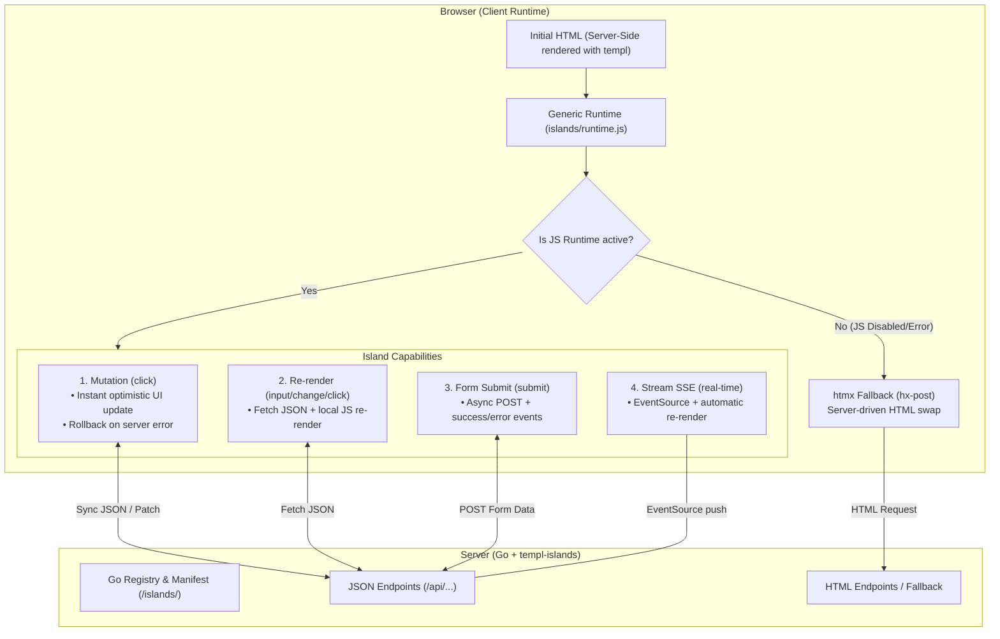

# templ-islands


Same templ component, rendered server-side or hydrated client-side under Go — with the server deciding per component, and a generic runtime handling optimistic UI.

## What it solves

Server-driven web apps (templ + htmx/Datastar) re-render a fragment on the server for every interaction. Under heavy interactive traffic that CPU cost adds up. templ-islands lets you mark components as **islands**: the page renders server-side, but each island's interactions run in the browser with optimistic UI, while the server only persists and answers JSON.

The demo validated this with real numbers: server-driven re-rendered the button on every like; the client mode rendered **zero** HTML server-side, and the fragment render alone cost ~6x more than the whole JSON operation.

## Quick path

1. Add `templ-islands` and declare your islands with `// @island` directives in your `.templ` files.
2. Run `templ-islands generate` to produce `islands_gen.go`.
3. Register the islands in `main.go` and mount the runtime handler.
4. Run the example: `cd examples/social && go run .` → http://localhost:8081.

## Three capabilities

| Capability | Trigger | What the client runtime does |
|------------|---------|------------------------------|
| **Mutation** (like, follow, counters) | `click` | Applies declared optimistic ops instantly, syncs with a JSON endpoint, applies the server response (source of truth) or rolls back on error. |
| **Re-render** (lists, filters, search) | `input`, `change` or `click` | Fetches JSON from the endpoint, loads the island's JS renderer and re-renders the target container locally. |
| **Form submit** (create/edit, checkout) | `submit` | POSTs the form data, re-renders the target with the response and emits `islands:success` / `islands:error`. |
| **Stream (SSE)** (live chat, agent status, tasks) | server events | Opens an `EventSource` to the endpoint and re-renders the target whenever the server emits an event. |

All capabilities share one generic runtime (`islands/runtime.js`, embedded in the
binary) driven by a manifest generated from the Go registry. Adding an island
never requires touching the JS.

**Streams (real time):** the page opts in with
`<div data-stream="chat" data-target="#chat"></div>`; the server pushes JSON
events with the `SSEHeaders`/`WriteSSE` helpers (or your own SSE endpoint) and
the runtime re-renders the target with the island's renderer. This covers live
chat, agent status and task feeds. See [`docs/SSE.md`](docs/SSE.md) for the
design and the example chat in `examples/social`.

**Shared domain keys:** add `data-key="post-1"` to an island and the mutation
applies to every instance with the same key on the page (e.g. the same post in
the feed and in a modal).

**Error feedback:** every failure emits `islands:error` on `document` with
`{ island, error, status?, response? }` — listen and show a toast. Success
emits `islands:success` with `{ island, data? }`.

**Field errors (forms):** a non-2xx response with
`{"field_errors": {"email": "Email invalido"}}` is bound automatically: the
runtime fills every `[data-error-for="email"]` element, adds `.invalid` to the
matching `[name="email"]` input, and clears both on the next submit.

**Insert mode (append/prepend):** add `data-swap="append"` (or `"prepend"`) to
an island and the renderer output is inserted instead of replacing the target —
for chat deltas, feeds and infinite scroll.

**CSRF:** if the page declares `<meta name="csrf-token" content="...">`, the
runtime sends it as `X-CSRF-Token` on every mutating request (POST/PUT/DELETE),
never on GET.

## Usage

Declare the contract next to the component:

```templ
// @island like endpoint=/api/like/{post_id} method=POST
// @field likes selector=[data-mutate=likes] op=inc delta=1
// @field liked selector=[data-mutate=label] op=toggle-text true=Liked false=Like
// @field liked op=class-toggle class=liked
templ LikeButton(post Post) {
	<button
		data-island="like"
		data-post-id={ strconv.Itoa(post.ID) }
		hx-post={ fmt.Sprintf("/like/%d", post.ID) }   // server-driven fallback
		hx-swap="outerHTML"
	>
		<span class="label" data-mutate="label">Like</span>
		<span class="count" data-mutate="likes">{ post.Likes }</span>
	</button>
}
```

Generate the registry, then serve the runtime:

```bash
templ-islands generate -dir . -out islands_gen.go -package main
```

```go
reg := islands.New()
RegisterIslands(reg) // generated by templ-islands

mux.Handle("GET /islands/", http.StripPrefix("/islands/", reg.RuntimeHandler()))
// + your JSON endpoints: POST /api/like/{id} -> {"likes": 8, "liked": true}
```

**Fallback is built-in:** the button keeps `hx-post`, so if the runtime does not load, htmx takes over and the server-driven mode still works. Nothing breaks.

**Selector validation is built-in:** `templ-islands generate` fails with a clear error if a declared `data-mutate` selector does not exist in the template.

**Re-render with a select (filter dropdown):** declare `trigger=change` on the island and put `data-trigger="change"` on the `<select>` — the runtime debounces and re-renders the target with the selected value as `data-param`.

**Form submit example:**

```templ
// @island new-post endpoint=/api/posts method=POST render=/static/post-list.js trigger=submit
templ NewPostForm() {
	<form data-island="new-post" data-trigger="submit" data-target="#feed">
		<input type="text" name="text" required/>
		<button type="submit">Publicar</button>
	</form>
}
```

The server returns the data the renderer expects (in the example, the full post
list). On validation errors it can return a non-2xx JSON body — the runtime
emits `islands:error` with the `response` so your app can show the errors.

## Architecture



```
templ-islands/
├── islands/          # Go core: registry, manifest, embedded client runtime
├── cmd/templ-islands # CLI: scans @island directives, generates the registry
└── examples/social   # feed with like + follow (mutation) and search (re-render)
```

The client runtime is hypermedia-agnostic: the server-driven fallback currently uses htmx, but the adapter layer is designed to also support Datastar.

## Design notes

- The double renderer (templ + JS) exists only for re-render islands. Mutation islands have **no** renderer — the HTML always comes from templ.
- Re-render parity is enforced by a golden test: `parity_test.go` renders the templ component and the JS renderer with the same fixtures and fails on divergence. Requires Node.
- The full proposal and tradeoff analysis live in [`docs/propuesta-v2.md`](docs/propuesta-v2.md) (Spanish).

## Tests

```bash
go test ./...
```

## License

[MIT](LICENSE)
