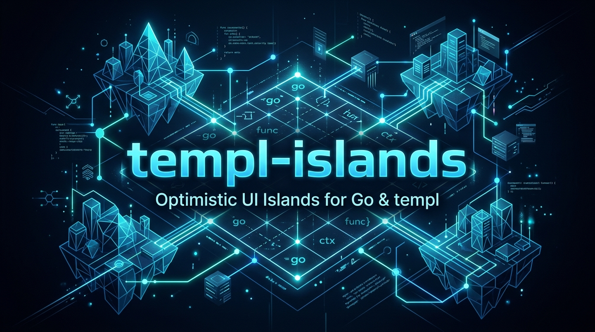
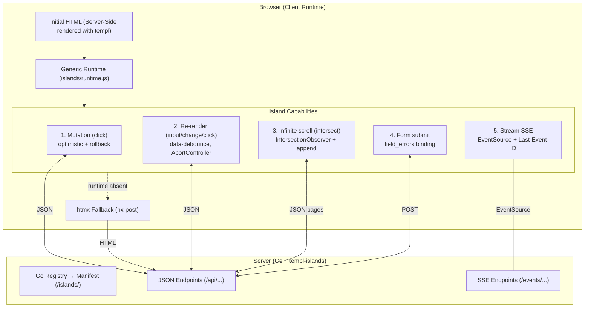

# templ-islands



**Same templ component, rendered server-side or hydrated client-side under Go.** Mark components as *islands*, and a generic embedded runtime handles optimistic UI, local re-render, forms, infinite scroll and real-time streams — without touching JavaScript per island.

## What it solves

Server-driven apps (templ + htmx/Datastar) re-render a fragment **on the server for every interaction**. Under heavy interactive traffic that CPU cost adds up, and every click pays a round-trip.

templ-islands flips the model: the page renders server-side with templ, but each **island** runs its interactions in the browser with optimistic UI. The server only persists and answers JSON.

The validation demo measured the difference with real traffic:

| Mode | Renders server-side | Cost per like |
|---|---|---|
| Server-driven (htmx) | 300 | 0.061 ms render + round-trip |
| Island (client) | **0** | 0.010 ms persist only |

The client mode eliminated **100% of the server-side render**, and rendering one tiny button cost ~6x more than the entire JSON operation.

## Quick start

```bash
go get github.com/SalvucciFacundo/templ-islands@latest
go install github.com/SalvucciFacundo/templ-islands/cmd/templ-islands@latest
```

1. **Declare** an island next to your component with `// @island` + `// @field` directives.
2. **Generate** the registry: `templ-islands generate -dir . -out islands_gen.go -package main`.
3. **Serve** the runtime: `mux.Handle("GET /islands/", http.StripPrefix("/islands/", reg.RuntimeHandler()))`.
4. Run the example to see every capability: `cd examples/social && go run .` → http://localhost:8081.

## The contract

The island contract lives in the `.templ` file as comment directives. The CLI scans them and generates the Go registry; the registry produces a JSON manifest; the generic runtime reads the manifest and does the rest.

```templ
// @island like endpoint=/api/like/{post_id} method=POST
// @field likes selector=[data-mutate=likes] op=inc delta=1
// @field liked selector=[data-mutate=label] op=toggle-text true=Liked false=Like
// @field liked op=class-toggle class=liked
templ LikeButton(post Post) {
	<button
		data-island="like"
		data-key={ fmt.Sprintf("post-%d", post.ID) }
		data-post-id={ strconv.Itoa(post.ID) }
		hx-post={ fmt.Sprintf("/like/%d", post.ID) }   // server-driven fallback
		hx-swap="outerHTML"
	>
		<span class="label" data-mutate="label">Like</span>
		<span class="count" data-mutate="likes">{ post.Likes }</span>
	</button>
}
```

```bash
templ-islands generate -dir . -out islands_gen.go -package main
# → generadas 1 islas (3 campos) -> islands_gen.go
```

```go
reg := islands.New()
RegisterIslands(reg) // generated by templ-islands

mux.Handle("GET /islands/", http.StripPrefix("/islands/", reg.RuntimeHandler()))
// + your JSON endpoints, e.g. POST /api/like/{id} -> {"likes": 8, "liked": true}
```

**Server-driven fallback is built-in:** the island keeps `hx-post`, so if the runtime does not load, htmx takes over and nothing breaks. Progressive enhancement by layers.

## Capabilities

| # | Capability | Trigger | What the runtime does |
|---|------------|---------|------------------------|
| 1 | **Mutation** (like, follow, counters) | `click` | Applies declared optimistic ops instantly, syncs with the JSON endpoint, applies the server response (source of truth) or rolls back on error. |
| 2 | **Re-render** (lists, filters, search) | `input`, `change` or `click` | Fetches JSON from the endpoint, loads the island's JS renderer and re-renders the target. |
| 3 | **Infinite scroll** | `intersect` | An `IntersectionObserver` on a sentinel fetches the next page and appends it; disconnects when the server answers `[]`. |
| 4 | **Form submit** (create/edit, checkout) | `submit` | POSTs the form data, re-renders the target, binds `field_errors` inline. |
| 5 | **Stream (SSE)** (live chat, agent status, tasks) | server events | Opens an `EventSource`, re-renders the target on every event, resumes from `Last-Event-ID`. |

### 1. Mutation — optimistic UI

Atomic operations declared in `@field`: `inc`, `toggle-text`, `class-toggle`. The user sees the change instantly; the server response always wins; on failure the runtime rolls back.

```templ
// @island like endpoint=/api/like/{post_id} method=POST
// @field likes selector=[data-mutate=likes] op=inc delta=1
```

Extra behaviors:

- **`data-key="post-1"`** — shared domain key: the mutation applies to **every** instance with the same key on the page (same post in feed and modal).
- **`data-confirm="¿Eliminar?"`** — asks before destructive mutations.
- **`aria-disabled`** — the element is disabled (and announced) while the request is in flight.

### 2. Re-render — local render from data

The server returns JSON; the JS renderer (a file you register once) converts it to HTML; the runtime swaps the target.

```templ
// @island post-list endpoint=/api/posts method=GET render=/static/post-list.js trigger=input
<input
	class="search" data-island="post-list" data-trigger="input"
	data-target="#feed" data-param="q" data-debounce="300"
/>
```

- `data-trigger` — `input`, `change` (selects) or `click`.
- `data-debounce` — milliseconds (default 300; `100` for autocomplete, `500` for heavy search).
- `data-param` — the query parameter that receives the control value.
- `data-swap="append"` / `"prepend"` — insert instead of replace (chat deltas, feeds).

### 3. Infinite scroll — `intersect`

A sentinel element with `data-trigger="intersect"` fetches the next page when it enters the viewport and appends it.

```templ
// @island post-more endpoint=/api/posts method=GET render=/static/post-list.js trigger=intersect
<div
	class="sentinel" data-island="post-more" data-trigger="intersect"
	data-target="#feed" data-param="page" data-page="2" data-swap="append"
></div>
```

The runtime pauses while in flight, advances `data-page` after each success, and **disconnects when the server answers `[]`** (end of list). The server endpoint must support `?page=N&per=M`.

### 4. Form submit — with inline validation errors

```templ
// @island new-post endpoint=/api/posts method=POST render=/static/post-list.js trigger=submit
<form data-island="new-post" data-trigger="submit" data-target="#feed">
	<input type="text" name="text" required/>
	<span class="field-error" data-error-for="text"></span>
</form>
```

- The server returns the data the renderer expects (the full post list in the example).
- **Field errors:** a non-2xx response with `{"field_errors": {"text": "..."}}` is bound automatically: the runtime fills every `[data-error-for="text"]`, marks the input `.invalid`, and clears both on the next submit.

### 5. Stream (SSE) — real time

The page opts in with a `data-stream` element; the runtime opens an `EventSource` and re-renders the target on every server event.

```templ
// @island chat-stream endpoint=/events/chat stream=true render=/static/chat-renderer.js
<div data-stream="chat-stream" data-target="#chat-messages"></div>
```

```go
islands.SSEHeaders(w)
islands.WriteSSERetry(w, 3000, 2000)          // reconnect with jitter
islands.WriteSSEID(w, id, map[string]any{"messages": msgs}) // event with id
```

- **Resilience:** events carry `id: N`; on reconnect the browser sends `Last-Event-ID` and the server re-sends the missed history. Nothing is lost.
- **Reconnect storm:** the server controls `retry:` with jitter (`WriteSSERetry`) so thousands of reconnecting clients do not hit at the same second.
- Full design: [`docs/SSE.md`](docs/SSE.md).

## Runtime behaviors (cross-cutting)

| Behavior | How |
|---|---|
| **Fallback** | Islands keep `hx-post`; htmx takes over when the runtime is absent |
| **Stale responses** | Re-render fetches cancel the previous in-flight request for the same target (`AbortController`); aborts are not errors. Mutations are never cancelled — guarded by disable + `aria-disabled` |
| **CSRF** | `<meta name="csrf-token">` is sent as `X-CSRF-Token` on mutating requests only, never GET |
| **Events** | `islands:success` / `islands:error` dispatched on `document` — listen and show toasts |
| **Selector validation** | `templ-islands generate` fails with a clear error if a declared `data-mutate` selector does not exist in the template |

## Server-side API (`islands` package)

| Function | Purpose |
|---|---|
| `New()` / `Register(name, fields, endpoint, method)` | Declare a mutation island |
| `RegisterRender(name, endpoint, method, render, trigger)` | Declare a re-render island |
| `RegisterStream(name, endpoint, render)` | Declare a real-time SSE island |
| `RuntimeHandler()` | Serves `runtime.js` + generated `manifest.json` (embedded) |
| `SSEHeaders(w)` / `WriteSSE(w, data)` | Open and write an SSE stream |
| `WriteSSEID(w, id, data)` | Write an SSE event with `id:` (for `Last-Event-ID` resume) |
| `WriteSSERetry(w, base, jitter)` | Emit `retry:` with jitter against reconnect storms |

## CLI (`templ-islands`)

```
templ-islands -dir . -out islands_gen.go -package main
```

Scans `.templ` files for `// @island` directives and generates `RegisterIslands`. Validates that every `data-mutate` selector exists in the template.

## Architecture



```
templ-islands/
├── islands/            # Go core: registry, manifest, embedded runtime.js, SSE helpers
├── cmd/templ-islands   # CLI: scans @island directives, generates the registry
└── examples/social     # 9 islands: like, follow, search, infinite scroll, posts,
                        # comments, delete, agent chat (form + SSE)
```

The client runtime is **hypermedia-agnostic**: the fallback currently uses htmx, but the adapter layer is designed to also support Datastar.

## Design notes

- The double renderer (templ + JS) exists **only** for re-render islands. Mutation islands have **no** renderer — the HTML always comes from templ.
- Re-render parity is enforced by a golden test: `parity_test.go` renders the templ component and the JS renderer with the same fixtures and fails on divergence. Requires Node.
- The full proposal and tradeoff analysis: [`docs/propuesta-v2.md`](docs/propuesta-v2.md) (Spanish).

## Documentation

| Doc | What |
|---|---|
| [`docs/SSE.md`](docs/SSE.md) | Real-time layer design (SSE, retry, Last-Event-ID) |
| [`docs/propuesta-v2.md`](docs/propuesta-v2.md) | Original proposal and tradeoffs (Spanish) |
| [`docs/BACKLOG.md`](docs/BACKLOG.md) | Deferred ideas and priorities |

## Tests

```bash
go test ./...   # unit + golden parity test (needs Node)
```

## License

[MIT](LICENSE)
