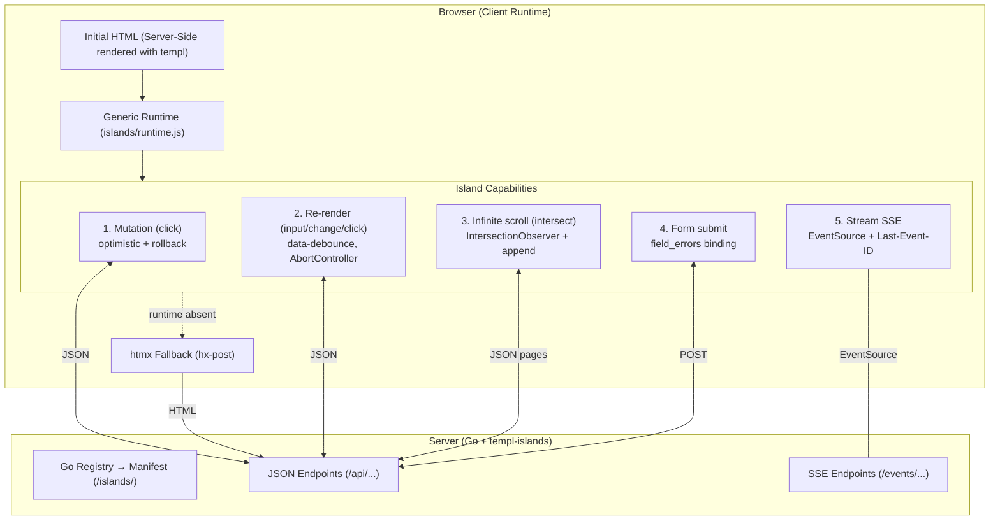

# Architecture

How templ-islands is built and why.

## Diagram



## Layout

```
templ-islands/
├── islands/              # Go core
│   ├── registry.go       # Registry: Register, RegisterRender, RegisterStream
│   ├── runtime.go        # RuntimeHandler (embedded runtime.js + manifest)
│   ├── runtime-core.js   # Pure functions (tested with node --test)
│   ├── runtime.js        # Generic client runtime (DOM)
│   └── sse.go            # SSE helpers (headers, write, retry, ping)
├── cmd/templ-islands/    # CLI: scans @island directives, generates the registry
├── examples/social/      # 9 islands: like, follow, search, infinite scroll,
│                         # posts, comments, delete, agent chat (form + SSE)
└── docs/                 # usage, SSE design, proposal, backlog
```

## Design decisions

- **One generic runtime, zero per-island JS.** The manifest generated from the
  Go registry drives everything; adding an island never requires touching
  JavaScript.
- **The double renderer exists only for re-render islands.** Mutation islands
  have **no** renderer — the HTML always comes from templ. The re-render parity
  is enforced by a golden test (`parity_test.go`) that renders the templ
  component and the JS renderer with the same fixtures and fails on divergence.
- **Optimistic with server-as-source-of-truth.** The user sees the change
  instantly, the server response always wins, failures roll back.
- **Progressive enhancement by layers.** Islands keep `hx-post`: if the runtime
  does not load, htmx takes over and the server-driven mode still works.
- **Hypermedia-agnostic.** The fallback currently uses htmx; the adapter layer
  is designed to also support Datastar (see the backlog).
- **SSE for real time, not WebSocket.** Receiving is one-way (server → client);
  sending is a normal form submit. SSE gives automatic reconnection and
  `Last-Event-ID` resume natively.
- **The event hub belongs to the app.** The library provides SSE helpers; who
  emits events (agent output, feeds) is the app's responsibility (see the
  example broker).

## Three problems it solves

| Problem | Solved by |
|---|---|
| Server CPU cost per interaction | Mutation + re-render (client does the work) |
| Perceived latency | Optimistic UI (instant, sync in background) |
| Real-time consistency (what others do) | Streams (SSE) |

See the full proposal and tradeoff analysis in
[`propuesta-v2.md`](propuesta-v2.md) (Spanish).
